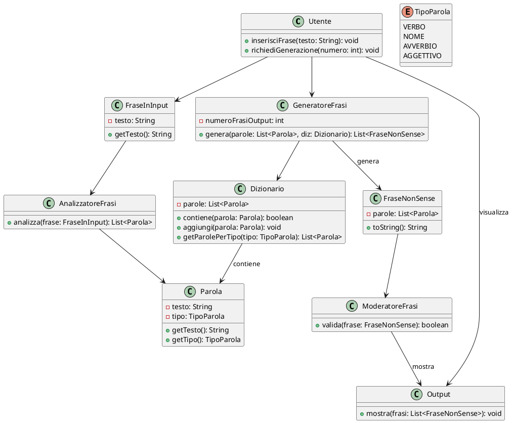

# Class Diagram

```plantuml
@startuml
class Utente {
  + inserisciFrase(testo: String): void
  + richiediGenerazione(numero: int): void
}

class FraseInInput {
  - testo: String
  + getTesto(): String
}

class Parola {
  - testo: String
  - tipo: TipoParola
  + getTesto(): String
  + getTipo(): TipoParola
}

enum TipoParola {
  VERBO
  NOME
  AVVERBIO
  AGGETTIVO
}

class Dizionario {
  - parole: List<Parola>
  + contiene(parola: Parola): boolean
  + aggiungi(parola: Parola): void
  + getParolePerTipo(tipo: TipoParola): List<Parola>
}

class AnalizzatoreFrasi {
  + analizza(frase: FraseInInput): List<Parola>
}

class GeneratoreFrasi {
  - numeroFrasiOutput: int
  + genera(parole: List<Parola>, diz: Dizionario): List<FraseNonSense>
}

class FraseNonSense {
  - parole: List<Parola>
  + toString(): String
}

class ModeratoreFrasi {
  + valida(frase: FraseNonSense): boolean
}

class Output {
  + mostra(frasi: List<FraseNonSense>): void
}

Utente --> FraseInInput
Utente --> GeneratoreFrasi
FraseInInput --> AnalizzatoreFrasi
AnalizzatoreFrasi --> Parola
Dizionario --> Parola : contiene
GeneratoreFrasi --> Dizionario
GeneratoreFrasi --> FraseNonSense : genera
FraseNonSense --> ModeratoreFrasi
ModeratoreFrasi --> Output : mostra
Utente --> Output : visualizza
@enduml
```
