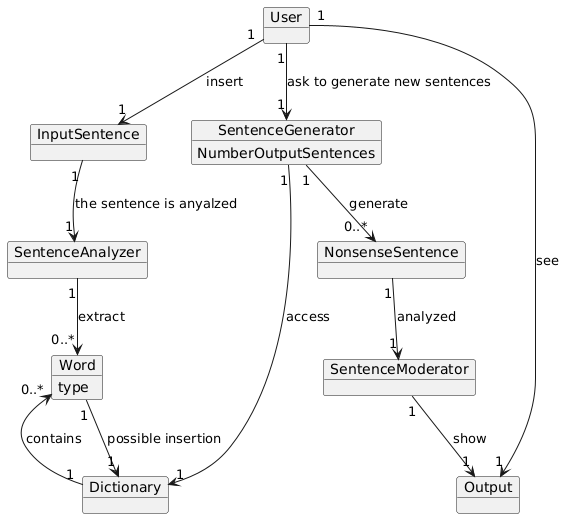
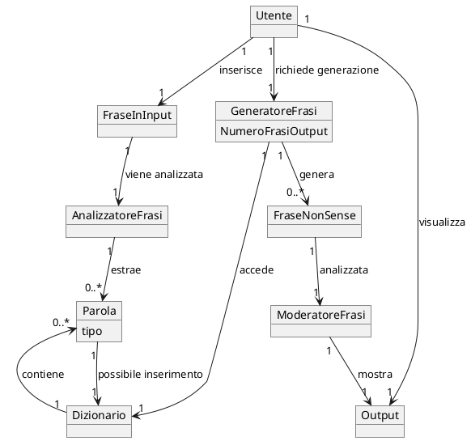

# Domain Model

```plantuml
@startuml
object Utente
object FraseInInput
object FraseNonSense
object Dizionario
object Parola {
tipo
}
object GeneratoreFrasi {
NumeroFrasiOutput
}
object AnalizzatoreFrasi
object ModeratoreFrasi
object Output

Utente "1"--> "1" FraseInInput : inserisce
Utente "1" --> "1" GeneratoreFrasi : richiede generazione
FraseInInput "1"--> "1" AnalizzatoreFrasi : viene analizzata
Dizionario "1" --> "0..*" Parola : contiene
GeneratoreFrasi  "1"--> "1" Dizionario : accede
GeneratoreFrasi "1"--> "0..*" FraseNonSense : genera
AnalizzatoreFrasi "1" --> "0..*" Parola : estrae
Parola "1"--> "1" Dizionario : possibile inserimento
FraseNonSense "1"--> "1" ModeratoreFrasi : analizzata
ModeratoreFrasi "1"--> "1" Output : mostra
Utente "1" --> "1" Output : visualizza
@enduml 
```
