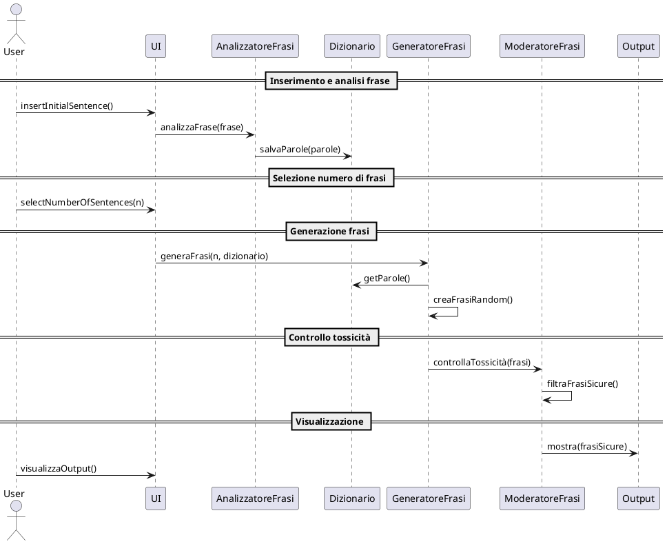
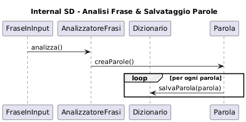
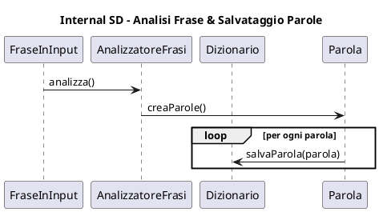
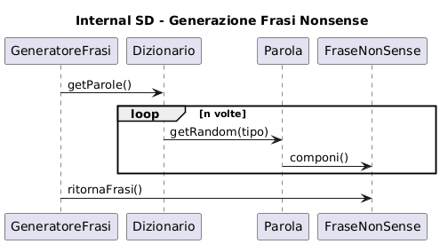
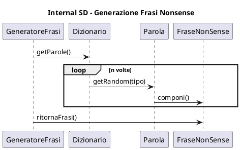
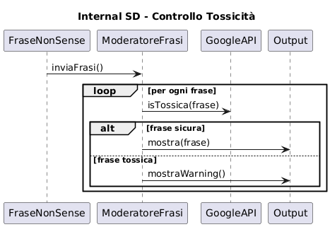
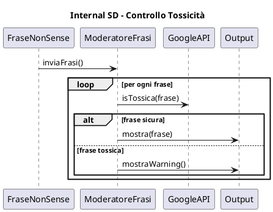
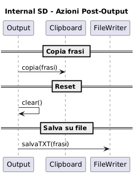
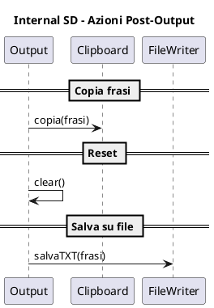

# System Sequence Diagram

# Internal Sequence Diagrams

## Analisi frasi e salvataggio

## Generazione di frasi nonsense

## Controllo tossicità

## Azioni post-output: reset, copia, salvataggio

