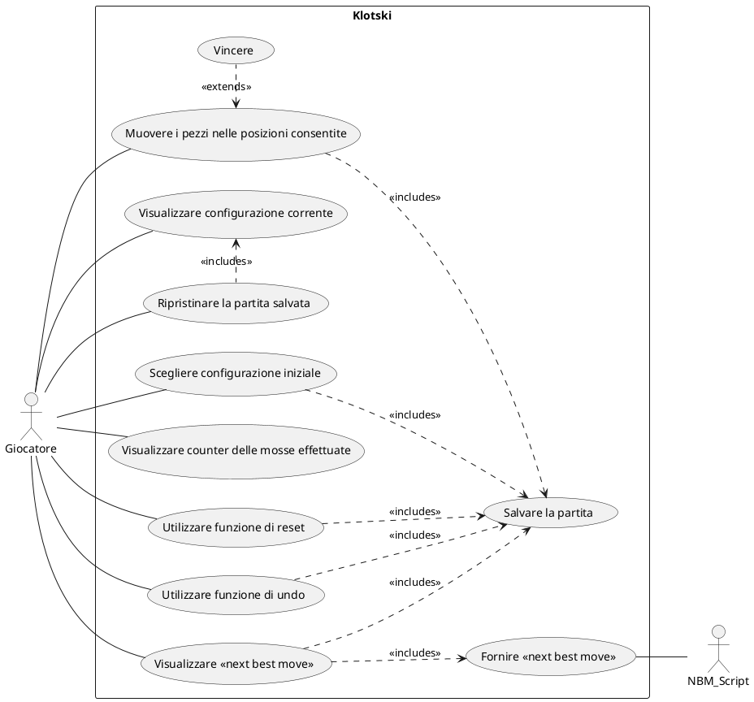

# Use Cases
1. Enter Initial Sentence
2. Selection Number of Output Sentences
3. 

### Use Case 1
<table>
  <tr>
    <td><b>Use Case Name</b>
    <td>Enter Initial Sentence</td>
  </tr>
  <tr>
    <td><b>Actors</b></td>
    <td>User</td>
  </tr>
  <tr>
    <td><b>Description</b></td>
    <td>Input of a sentence which will be syntactically analyzed by the system.</td>
  </tr>
  <tr>
    <td><b>Preconditions</b></td>
    <td>-</td>
  </tr>
  <tr>
    <td><b>Main Scenario</b></td>
    <td>The user enters a sentence in the text box.</td>
  </tr>
  <tr>
    <td><b>Alternative Scenario</b></td>
    <td>The user does not input a sentence: the system shows an error message.</td>
  </tr>
  <tr>
    <td><b>Post-Conditions</b></td>
    <td>The sentence is stored and parsed for further processing.</td>
  </tr>
    <tr>
    <td><b>Notes</b></td>
    <td>-</td>
  </tr>
</table>

### Use Case 2
<table>
    <tr>
        <td><b>Use Case Name</b>
        <td>Selection Number of Output Sentences</td>
    </tr>
    <tr>
         <td><b>Actors</b></td>
         <td>User</td>
    </tr>
    <tr>
         <td><b>Description</b></td>
         <td>The user selects the desired amount of nonsense sentences to output.</td>
    </tr>
    <tr>
         <td><b>Preconditions</b></td>
         <td>-</td>
    </tr>
    <tr>
         <td><b>Main Scenario</b></td>
         <td>The user selects the number of nonsense sentences.</td>
    </tr>
    <tr>
         <td><b>Alternative Scenario</b></td>
         <td>No sentence is entered, so nothing is generated.</td>
    </tr>
    <tr>
         <td><b>Post-Conditions</b></td>
         <td>System is ready to generate the specified number of sentences.</td>
    </tr>
    <tr>
         <td><b>Note</b></td>
         <td>-</td>
    </tr>
</table>

### Use Case 3
<table>
    <tr>
        <td><b>Use Case Name</b>
        <td>View Generated Sentences</td>
    </tr>
    <tr>
        <td><b>Actors</b></td>
        <td>User</td>
    </tr>
    <tr>
        <td><b>Description</b></td>
        <td>The user views the number of nonsense sentences generated as output.</td>
    </tr>
    <tr>
        <td><b>Preconditions</b></td>
        <td>The user must have entered an input sentence and selected the number of nonsense sentences to generate.</td>
    </tr>
    <tr>
        <td><b>Main Scenario</b></td>
        <td>After clicking the “Generate” button, the user sees the generated nonsense sentences displayed as output.</td>
    </tr>
    <tr>
        <td><b>Alternative Scenario</b></td>
        <td>If the user has not entered both the input sentence and the number of desired output sentences,
            then no sentences will be generated or displayed.</td>
    </tr>
    <tr>
        <td><b>Post-Conditions</b></td>
        <td>-</td>
    </tr>
    <tr>
        <td><b>Note</b></td>
        <td>-</td>
    </tr>
</table>

### Use Case 4
<table>
    <tr>
        <th><b id="UC4">Use Case 4</b></th>
    </tr>
    <tr>
        <td><b>Use Case Name</b>
        <td>Toxicity Check</td>
    </tr>
    <tr>
        <td><b>Actors</b></td>
        <td>Software</td>
    </tr>
    <tr>
        <td><b>Description</b></td>
        <td>The system checks that each of the generated sentences doesn't include appropriate content.</td>
    </tr>
    <tr>
        <td><b>Preconditions</b></td>
        <td>All the requested sentences in output have been generated</td>
    </tr>
    <tr>
        <td><b>Main Scenario</b></td>
        <td>Sentence is safe, so it's shown in output.</td>
    </tr>
    <tr>
        <td><b>Alternative Scenario</b></td>
        <td>Sentence is toxic, so warning message is shown instead.</td>
    </tr>
    <tr>
        <td><b>Post-Conditions</b></td>
        <td>-</td>
    </tr>
    <tr>
        <td><b>Note</b></td>
        <td>Google API is used to check each sentence</td>
    </tr>
</table>

# Grafo Use Cases

