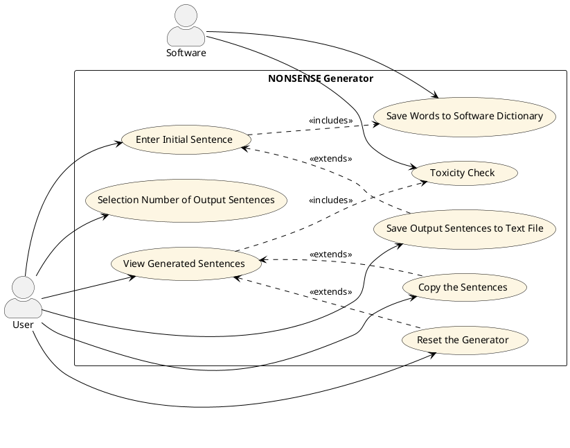

# Use Cases
1. Inserimento frase iniziale
2. 

### Use Case 1
<table>
  <tr>
    <td><b>Use Case Name</b>
    <td>Inserimento frase iniziale</td>
  </tr>
  <tr>
    <td><b>Attori</b></td>
    <td>User</td>
  </tr>
  <tr>
    <td><b>Descrizione</b></td>
    <td>Viene inserita la frase da parte dell’utente che poi il sistema dividerà sintatticamente.</td>
  </tr>
  <tr>
    <td><b>Precondizioni</b></td>
    <td>-</td>
  </tr>
  <tr>
    <td><b>Scenario principale</b></td>
    <td>L’utente digita la frase in una casella di testo.</td>
  </tr>
  <tr>
    <td><b>Scenario alternativo</b></td>
    <td>Il sistema genera un messaggio di errore quando la casella di testo per la frase input non viene compilata.</td>
  </tr>
  <tr>
    <td><b>Post-Conditions</b></td>
    <td>The sentence is stored and parsed for further processing.</td>
  </tr>
    <tr>
    <td><b>Notes</b></td>
    <td>-</td>
  </tr>
</table>

# Grafo Use Cases

