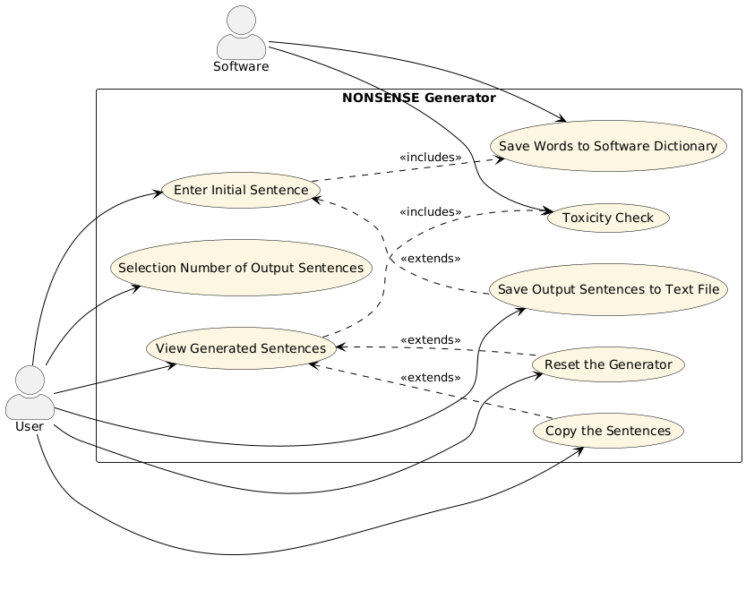
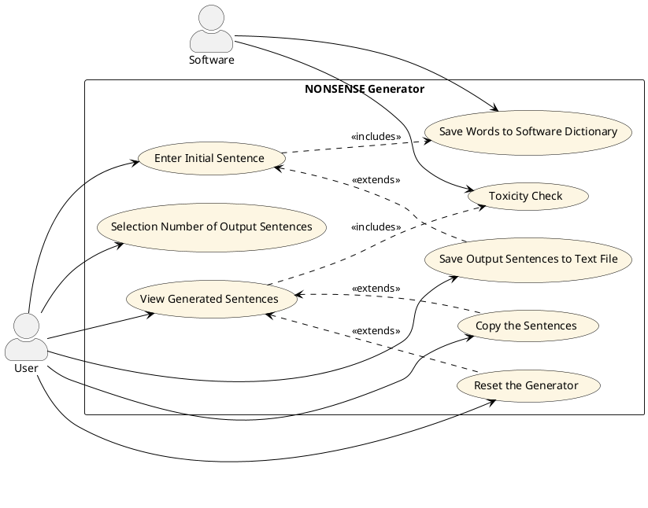

# Use Cases
1. Inserimento frase iniziale
2. Scelta del numero di frasi in output
3. Vedere risultati delle frasi generate
4. Controllo tossicità
5. Reset del generatore
6. Copia frasi
7. Salvataggio frase nel file di testo
8. Salvataggio parole nel dizionario del software

### Use Case 1
<table>
  <tr>
    <td><b>Nome Use Case</b>
    <td>Inserimento frase iniziale</td>
  </tr>
  <tr>
    <td><b>Attori</b></td>
    <td>Utente</td>
  </tr>
  <tr>
    <td><b>Descrizione</b></td>
    <td>Viene inserita la frase da parte dell’utente che poi il sistema dividerà sintatticamente.</td>
  </tr>
  <tr>
    <td><b>Precondizioni</b></td>
    <td>-</td>
  </tr>
  <tr>
    <td><b>Scenario principale</b></td>
    <td>L’utente digita la frase in una casella di testo.</td>
  </tr>
  <tr>
    <td><b>Scenario alternativo</b></td>
    <td>Il sistema genera un messaggio di errore quando la casella di testo per la frase input non viene compilata.</td>
  </tr>
  <tr>
    <td><b>Post-condizioni</b></td>
    <td>La frase viene memorizzata ed analizzata per un’ulteriore elaborazione.</td>
  </tr>
    <tr>
    <td><b>Note</b></td>
    <td>-</td>
  </tr>
</table>

### Use Case 2
<table>
  <tr>
    <td><b>Nome Use Case</b>
    <td>Scelta del numero di frasi in output</td>
  </tr>
  <tr>
    <td><b>Attori</b></td>
    <td>Utente</td>
  </tr>
  <tr>
    <td><b>Descrizione</b></td>
    <td>L'utente seleziona la quantità desiderata di frasi nonsense in output.</td>
  </tr>
  <tr>
    <td><b>Precondizioni</b></td>
    <td>-</td>
  </tr>
  <tr>
    <td><b>Scenario principale</b></td>
    <td>L’utente sceglie il numero di frasi senza senso</td>
  </tr>
  <tr>
    <td><b>Scenario alternativo</b></td>
    <td>L’utente non inserisce nulla e non viene generato nulla.</td>
  </tr>
  <tr>
    <td><b>Post-condizioni</b></td>
    <td>Il sistema è pronto a generare il numero specificato di frasi.</td>
  </tr>
    <tr>
    <td><b>Note</b></td>
    <td>-</td>
  </tr>
</table>

### Use Case 3
<table>
  <tr>
    <td><b>Nome Use Case</b>
    <td>Vedere i risultati delle frasi generate</td>
  </tr>
  <tr>
    <td><b>Attori</b></td>
    <td>Utente</td>
  </tr>
  <tr>
    <td><b>Descrizione</b></td>
    <td>L'utente visualizza il numero di frasi nonsense generate in output.</td>
  </tr>
  <tr>
    <td><b>Precondizioni</b></td>
    <td>L'utente deve aver scritto una frase in input e aver selezionato il numero di frasi nonsense che desidera in output.</td>
  </tr>
  <tr>
    <td><b>Scenario principale</b></td>
    <td>Dopo aver cliccato il pulsante “genera”, l’utente visualizza le frasi in output.</td>
  </tr>
  <tr>
    <td><b>Scenario alternativo</b></td>
    <td>Se l’utente non ha inserito sia la frase in input che il numero di frasi in output, allora non ci sarà alcuna frase in output.</td>
  </tr>
  <tr>
    <td><b>Post-condizioni</b></td>
    <td>-</td>
  </tr>
    <tr>
    <td><b>Note</b></td>
    <td>-</td>
  </tr>
</table>

### Use Case 4
<table>
  <tr>
    <td><b>Nome Use Case</b>
    <td>Controllo tossicità</td>
  </tr>
  <tr>
    <td><b>Attori</b></td>
    <td>Software</td>
  </tr>
  <tr>
    <td><b>Descrizione</b></td>
    <td>Il sistema controlla che ciascuna delle frasi generate non includa contenuti inappropriati.</td>
  </tr>
  <tr>
    <td><b>Precondizioni</b></td>
    <td>Sono state generate tutte le frasi richieste in output.</td>
  </tr>
  <tr>
    <td><b>Scenario principale</b></td>
    <td>La frase è adatta e viene mostrata come output.</td>
  </tr>
  <tr>
    <td><b>Scenario alternativo</b></td>
    <td>Se la frase non è adatta, al suo posto viene mostrato un messaggio di errore.</td>
  </tr>
  <tr>
    <td><b>Post-condizioni</b></td>
    <td>-</td>
  </tr>
    <tr>
    <td><b>Note</b></td>
    <td>Viene utilizzato l’API Google per analizzare ciascuna frase.</td>
  </tr>
</table>

### Use Case 5
<table>
  <tr>
    <td><b>Nome Use Case</b>
    <td>Reset del generatore</td>
  </tr>
  <tr>
    <td><b>Attori</b></td>
    <td>Utente</td>
  </tr>
  <tr>
    <td><b>Descrizione</b></td>
    <td>Quando l’utente clicca il pulsante “reset” vengono eliminate tutte le frasi generate fino a quel momento.</td>
  </tr>
  <tr>
    <td><b>Precondizioni</b></td>
    <td>E' stato cliccato il pulsante “reset”.</td>
  </tr>
  <tr>
    <td><b>Scenario principale</b></td>
    <td>Vengono eliminate tutte le frasi generate fino a quel momento.</td>
  </tr>
  <tr>
    <td><b>Scenario alternativo</b></td>
    <td>Se l’utente non ha inserito nulla, il reset non ha alcun effetto.</td>
  </tr>
  <tr>
    <td><b>Post-condizioni</b></td>
    <td>-</td>
  </tr>
    <tr>
    <td><b>Note</b></td>
    <td>-</td>
  </tr>
</table>

### Use Case 6
<table>
  <tr>
    <td><b>Nome Use Case</b>
    <td>Copia frasi</td>
  </tr>
  <tr>
    <td><b>Attori</b></td>
    <td>Utente</td>
  </tr>
  <tr>
    <td><b>Descrizione</b></td>
    <td>Quando l’utente clicca  il tasto “copia” il software fa in modo che venga permessa la copia delle frasi scelte.</td>
  </tr>
  <tr>
    <td><b>Precondizioni</b></td>
    <td>-</td>
  </tr>
  <tr>
    <td><b>Scenario principale</b></td>
    <td>E' permessa la copia della frase specifica o di tutte le frasi.</td>
  </tr>
  <tr>
    <td><b>Scenario alternativo</b></td>
    <td>Non è permessa alcuna copia.</td>
  </tr>
  <tr>
    <td><b>Post-condizioni</b></td>
    <td>-</td>
  </tr>
    <tr>
    <td><b>Note</b></td>
    <td>-</td>
  </tr>
</table>

### Use Case 7
<table>
  <tr>
    <td><b>Nome Use Case</b>
    <td>Salvataggio frase nel file di testo</td>
  </tr>
  <tr>
    <td><b>Attori</b></td>
    <td>Utente</td>
  </tr>
  <tr>
    <td><b>Descrizione</b></td>
    <td>Salvataggio delle parole presenti nella frase input all’interno di un dizionario del software.</td>
  </tr>
  <tr>
    <td><b>Precondizioni</b></td>
    <td>Aver inserito frase di input, numero di frasi di output volute e aver premuto il tasto “genera”.</td>
  </tr>
  <tr>
    <td><b>Scenario principale</b></td>
    <td>L’utente digita la frase che viene analizzata, le parole vengono salvate nel dizionario del software per poterle utilizzare quando verranno generate frasi nonsense</td>
  </tr>
  <tr>
    <td><b>Scenario alternativo</b></td>
    <td>Il sistema genera un messaggio quando la casella di testo per la frase input non viene compilata.</td>
  </tr>
  <tr>
    <td><b>Post-condizioni</b></td>
    <td>-</td>
  </tr>
    <tr>
    <td><b>Note</b></td>
    <td>File in formato di testo .txt</td>
  </tr>
</table>

### Use Case 8
<table>
  <tr>
    <td><b>Nome Use Case</b>
    <td>Reset del generatore</td>
  </tr>
  <tr>
    <td><b>Attori</b></td>
    <td>Software</td>
  </tr>
  <tr>
    <td><b>Descrizione</b></td>
    <td>Salvataggio automatico delle parole presenti nella frase input all’interno di un dizionario del software.</td>
  </tr>
  <tr>
    <td><b>Precondizioni</b></td>
    <td>Il sistema verifica la qualità dell'input: non sono ammesse stringhe vuote o voci contenenti solo spazi.</td>
  </tr>
  <tr>
    <td><b>Scenario principale</b></td>
    <td>L’utente digita la frase che viene analizzata e le parole vengono salvate nel dizionario del software per poterle utilizzare quando genero frasi nonsense.</td>
  </tr>
  <tr>
    <td><b>Scenario alternativo</b></td>
    <td>Il sistema genera un messaggio quando la casella di testo per la frase input non viene compilata.</td>
  </tr>
  <tr>
    <td><b>Post-condizioni</b></td>
    <td>Persistenza dei dati, che devono rimanere anche dopo la chiusura del programma.</td>
  </tr>
    <tr>
    <td><b>Note</b></td>
    <td>Deve esserci un utilizzo attivo di queste parole, almeno 1 per ogni frase generata.</td>
  </tr>
</table>

# Grafo Use Cases

