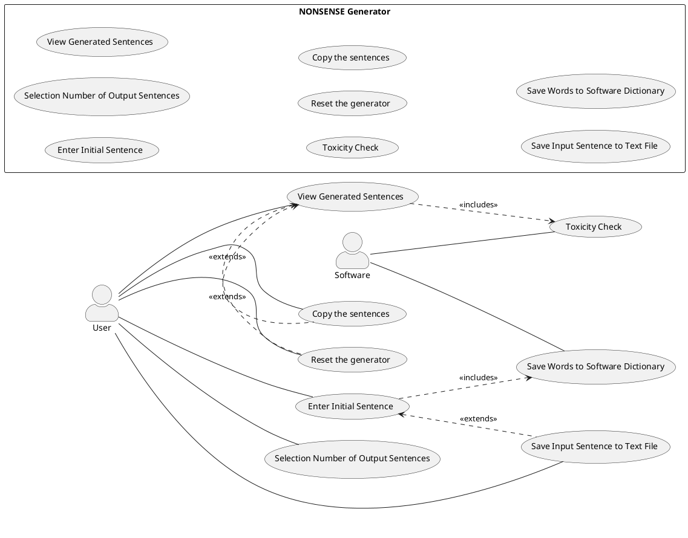

# Use Cases
1. Enter Initial Sentence
2. Selection Number of Output Sentences
3. View Generated Sentences
4. Toxicity Check
5. Reset the generator
6. Copy the sentences
7. Save Input Sentence to Text File
8. Save Words to Software Dictionary

### Use Case 1
<table>
  <tr>
    <td><b>Use Case Name</b>
    <td>Enter Initial Sentence</td>
  </tr>
  <tr>
    <td><b>Actors</b></td>
    <td>User</td>
  </tr>
  <tr>
    <td><b>Description</b></td>
    <td>Input of a sentence which will be syntactically analyzed by the system.</td>
  </tr>
  <tr>
    <td><b>Preconditions</b></td>
    <td>-</td>
  </tr>
  <tr>
    <td><b>Main Scenario</b></td>
    <td>The user enters a sentence in the text box.</td>
  </tr>
  <tr>
    <td><b>Alternative Scenario</b></td>
    <td>The user does not input a sentence: the system shows an error message.</td>
  </tr>
  <tr>
    <td><b>Post-Conditions</b></td>
    <td>The sentence is stored and parsed for further processing.</td>
  </tr>
    <tr>
    <td><b>Notes</b></td>
    <td>-</td>
  </tr>
</table>

### Use Case 2
<table>
    <tr>
        <td><b>Use Case Name</b>
        <td>Selection Number of Output Sentences</td>
    </tr>
    <tr>
         <td><b>Actors</b></td>
         <td>User</td>
    </tr>
    <tr>
         <td><b>Description</b></td>
         <td>The user selects the desired amount of nonsense sentences to output.</td>
    </tr>
    <tr>
         <td><b>Preconditions</b></td>
         <td>-</td>
    </tr>
    <tr>
         <td><b>Main Scenario</b></td>
         <td>The user selects the number of nonsense sentences.</td>
    </tr>
    <tr>
         <td><b>Alternative Scenario</b></td>
         <td>No sentence is entered, so nothing is generated.</td>
    </tr>
    <tr>
         <td><b>Post-Conditions</b></td>
         <td>System is ready to generate the specified number of sentences.</td>
    </tr>
    <tr>
         <td><b>Note</b></td>
         <td>-</td>
    </tr>
</table>

### Use Case 3
<table>
    <tr>
        <td><b>Use Case Name</b>
        <td>View Generated Sentences</td>
    </tr>
    <tr>
        <td><b>Actors</b></td>
        <td>User</td>
    </tr>
    <tr>
        <td><b>Description</b></td>
        <td>The user views the number of nonsense sentences generated as output.</td>
    </tr>
    <tr>
        <td><b>Preconditions</b></td>
        <td>The user must have entered an input sentence and selected the number of nonsense sentences to generate.</td>
    </tr>
    <tr>
        <td><b>Main Scenario</b></td>
        <td>After clicking the “Generate” button, the user sees the generated nonsense sentences displayed as output.</td>
    </tr>
    <tr>
        <td><b>Alternative Scenario</b></td>
        <td>If the user has not entered both the input sentence and the number of desired output sentences,
            then no sentences will be generated or displayed.</td>
    </tr>
    <tr>
        <td><b>Post-Conditions</b></td>
        <td>-</td>
    </tr>
    <tr>
        <td><b>Note</b></td>
        <td>-</td>
    </tr>
</table>

### Use Case 4
<table>
    <tr>
        <td><b>Use Case Name</b>
        <td>Toxicity Check</td>
    </tr>
    <tr>
        <td><b>Actors</b></td>
        <td>Software</td>
    </tr>
    <tr>
        <td><b>Description</b></td>
        <td>The system checks that each of the generated sentences doesn't include appropriate content.</td>
    </tr>
    <tr>
        <td><b>Preconditions</b></td>
        <td>All the requested sentences in output have been generated</td>
    </tr>
    <tr>
        <td><b>Main Scenario</b></td>
        <td>Sentence is safe, so it's shown in output.</td>
    </tr>
    <tr>
        <td><b>Alternative Scenario</b></td>
        <td>Sentence is toxic, so warning message is shown instead.</td>
    </tr>
    <tr>
        <td><b>Post-Conditions</b></td>
        <td>-</td>
    </tr>
    <tr>
        <td><b>Note</b></td>
        <td>Google API is used to check each sentence</td>
    </tr>
</table>

### Use Case 5
<table>
    <tr>
        <td><b>Use Case Name</b>
        <td>Reset the generator</td>
    </tr>
    <tr>
        <td><b>Actors</b></td>
        <td>User</td>
    </tr>
    <tr>
        <td><b>Description</b></td>
        <td>When the user clicks the “Reset” button, all previously generated nonsense sentences are removed.</td>
    </tr>
    <tr>
        <td><b>Preconditions</b></td>
        <td>The “Reset” button has been clicked.</td>
    </tr>
    <tr>
        <td><b>Main Scenario</b></td>
        <td>All generated nonsense sentences up to that moment are cleared from the interface.</td>
    </tr>
    <tr>
        <td><b>Alternative Scenario</b></td>
        <td>If the user has not entered anything, the reset action has no effect.</td>
    </tr>
    <tr>
        <td><b>Post-Conditions</b></td>
        <td>-</td>
    </tr>
    <tr>
        <td><b>Note</b></td>
        <td>-</td>
    </tr>
</table>

### Use Case 6
<table>
    <tr>
        <td><b>Use Case Name</b>
        <td>Copy the sentences</td>
    </tr>
    <tr>
        <td><b>Actors</b></td>
        <td>User</td>
    </tr>
    <tr>
        <td><b>Description</b></td>
        <td>When the user clicks the “Reset” button, all previously generated nonsense sentences are removed.</td>
    </tr>
    <tr>
        <td><b>Preconditions</b></td>
        <td>The user has selected which sentences they want to copy.</td>
    </tr>
    <tr>
        <td><b>Main Scenario</b></td>
        <td>The user is allowed to copy a specific sentence or all generated sentences.</td>
    </tr>
    <tr>
        <td><b>Alternative Scenario</b></td>
        <td>Copying is not allowed.</td>
    </tr>
    <tr>
        <td><b>Post-Conditions</b></td>
        <td>-</td>
    </tr>
    <tr>
        <td><b>Note</b></td>
        <td>-</td>
    </tr>
</table>

### Use Case 7
<table>
    <tr>
        <td><b>Use Case Name</b>
        <td>Save Input Sentence to Text File</td>
    </tr>
    <tr>
        <td><b>Actors</b></td>
        <td>User</td>
    </tr>
    <tr>
        <td><b>Description</b></td>
        <td>The words from the user’s input sentence are saved to the software’s internal dictionary.</td>
    </tr>
    <tr>
        <td><b>Preconditions</b></td>
        <td>The user has entered an input sentence, selected the number of output sentences, and clicked the “Generate” button.</td>
    </tr>
    <tr>
        <td><b>Main Scenario</b></td>
        <td>The user enters a sentence, which is then analyzed. The extracted words are saved to the software’s dictionary for future use in generating nonsense     
          sentences.</td>
    </tr>
    <tr>
          <td><b>Alternative Scenario</b></td>
          <td>If the input sentence field is left empty, the system displays an error message.</td>
    </tr>
    <tr>
          <td><b>Post-Conditions</b></td>
          <td>-</td>
    </tr>
    <tr>
          <td><b>Note</b></td>
          <td>Words are saved in a .txt text file.</td>
    </tr>
</table>

### Use Case 8
<table>
    <tr>
        <td><b>Use Case Name</b>
        <td>Save Words to Software Dictionary</td>
    </tr>
    <tr>
        <td><b>Actors</b></td>
        <td>Software</td>
    </tr>
    <tr>
        <td><b>Description</b></td>
        <td>Automatic saving of the words from the user’s input sentence into the software’s internal dictionary.</td>
    </tr>
    <tr>
        <td><b>Preconditions</b></td>
        <td>The system checks the quality of the input: no empty strings or whitespace-only entries are allowed.</td>
    </tr>
    <tr>
        <td><b>Main Scenario</b></td>
        <td>The user enters a sentence, which is analyzed.  The extracted words are saved to the internal dictionary so they can be reused in the generation of nonsense sentences.</td>
    </tr>
    <tr>
        <td><b>Alternative Scenario</b></td>
        <td>If the input sentence field is left empty, the system displays an error message.</td>
    </tr>
    <tr>
        <td><b>Post-Conditions</b></td>
        <td>Data persistence: the saved words must remain available even after the program is closed.</td>
    </tr>
    <tr>
        <td><b>Note</b></td>
        <td>The saved words must be actively used in future generations, at least one saved word should appear in each generated sentence.</td>
    </tr>
</table>

# Grafo Use Cases

