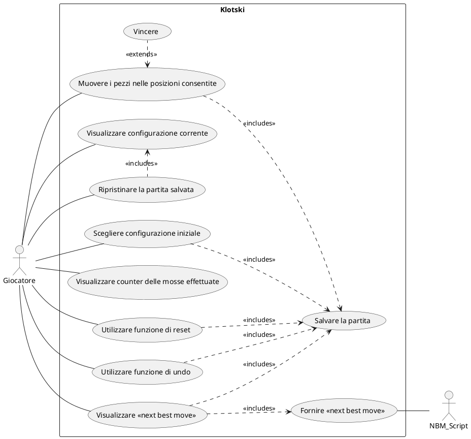

# Use Cases
1. Enter Initial Sentence
2. Selection Number of Output Sentences
3. 

### Use Case 1
<table>
  <tr>
    <td><b>Use Case Name</b>
    <td>Enter Initial Sentence</td>
  </tr>
  <tr>
    <td><b>Actors</b></td>
    <td>User</td>
  </tr>
  <tr>
    <td><b>Description</b></td>
    <td>Input of a sentence which will be syntactically analyzed by the system.</td>
  </tr>
  <tr>
    <td><b>Preconditions</b></td>
    <td>-</td>
  </tr>
  <tr>
    <td><b>Main Scenario</b></td>
    <td>The user enters a sentence in the text box.</td>
  </tr>
  <tr>
    <td><b>Alternative Scenario</b></td>
    <td>The user does not input a sentence: the system shows an error message.</td>
  </tr>
  <tr>
    <td><b>Post-Conditions</b></td>
    <td>The sentence is stored and parsed for further processing.</td>
  </tr>
    <tr>
    <td><b>Notes</b></td>
    <td>-</td>
  </tr>
</table>

### Use Case 2
<table>
  <tr>
    <td><b>Use Case Name</b>
    <td>Enter Initial Sentence</td>
  </tr>
  <tr>
    <td><b>Actors</b></td>
    <td>User</td>
  </tr>
  <tr>
    <td><b>Description</b></td>
    <td>Input of a sentence which will be syntactically analyzed by the system.</td>
  </tr>
  <tr>
    <td><b>Preconditions</b></td>
    <td>-</td>
  </tr>
  <tr>
    <td><b>Main Scenario</b></td>
    <td>The user enters a sentence in the text box.</td>
  </tr>
  <tr>
    <td><b>Alternative Scenario</b></td>
    <td>The user does not input a sentence: the system shows an error message.</td>
  </tr>
  <tr>
    <td><b>Post-Conditions</b></td>
    <td>The sentence is stored and parsed for further processing.</td>
  </tr>
    <tr>
    <td><b>Notes</b></td>
    <td>-</td>
  </tr>
</table>

# Grafo Use Cases

